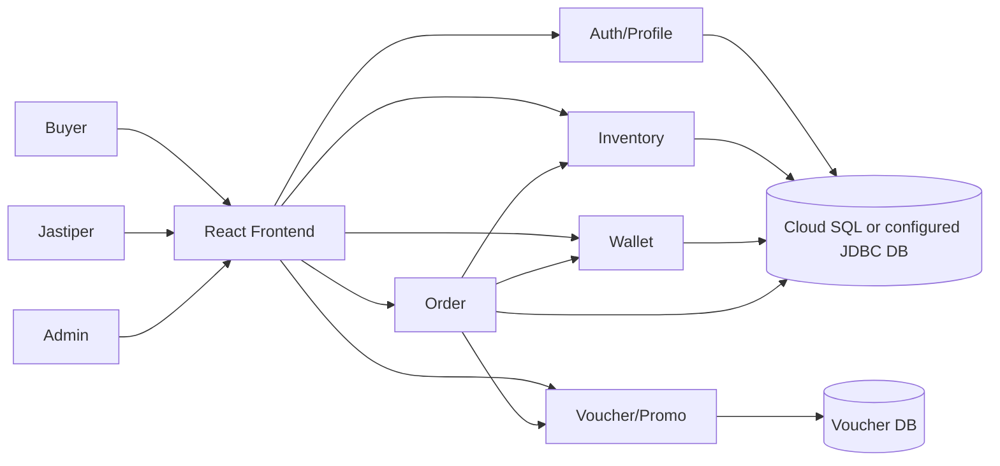
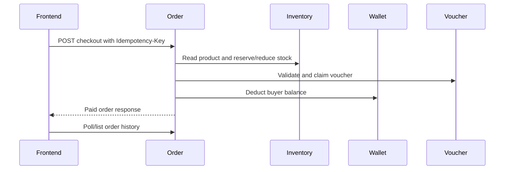

# Software Architecture

## Context

The application is JaStip Online Nasional. Buyers browse products, manage wallet balance, checkout with vouchers, and track orders. Jastipers manage product/order fulfillment. Admin users monitor orders and manage vouchers.

## Container View

| Container | Responsibility | Public deployment |
|---|---|---|
| React frontend | Browser UI, role navigation, API integration, Selenium target | `advprog-frontend-m25-m50` on Cloud Run |
| Auth/Profile | Registration, login, JWT/role handling, profile | `auth-profile-api` on Cloud Run |
| Inventory | Product catalog, stock, jastiper product ownership | `inventory-api` on Cloud Run |
| Wallet | Balance, top-up, payment, refund, transaction history | `wallet-api` on Cloud Run |
| Order | Checkout orchestration, lifecycle, rating, admin monitoring | `order-api` on Cloud Run |
| Voucher/Promo | Voucher visibility, validation, claim, admin CRUD | `voucher-promo-api` on Cloud Run |

## Checkout Sequence

## Architectural Benefit

The main benefit is independent grading and failure isolation. Inventory, Wallet, Voucher, and Order can be tested and deployed independently, while Order owns the cross-service orchestration. Cloud Run gives each service independent revision history, scaling controls, and rollback.

The tradeoff is that checkout cannot use a single database transaction across all services. The project mitigates that with deterministic request identifiers, idempotent downstream operations, and refund/cancel regression tests.

## Architecture Testing

| Test type | Evidence |
|---|---|
| Functional architecture | 32 Selenium scenarios cross frontend, Auth, Inventory, Wallet, Order, and Voucher. |
| Security boundaries | Unauthorized buyer/admin/jastiper navigation and invalid admin-token cases are in Selenium. |
| Concurrency/idempotency | Backend tests cover duplicate checkout, wallet deduction/refund idempotency, stock mutation, and voucher claim behavior. |
| Load/performance smoke | `scripts/perf/profile-cloudrun-smoke.ps1` in the workspace and Selenium/API timing evidence can be run against Cloud Run. |

